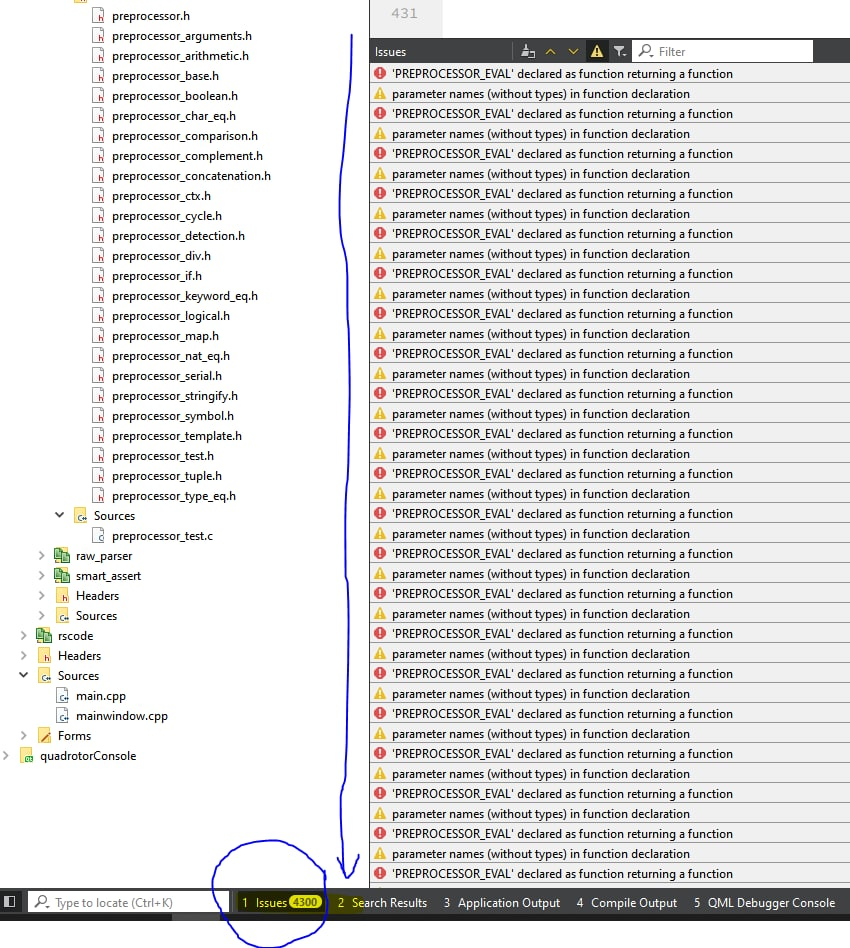

# Preprocessor
 * PREPROCESSOR - a library that allows you to summon the devil or other evil spirits in the programming language C99 or later, and no joke, it allows you to use preprocessor metaprogramming in C
 
 # Supported Compilers:
 *      MSVC: After Visual Studio 2019 verion 16.6;	Compiler version after--> msvc v19.26, 
         you must add /Zc:preprocessor to your compilation flags
 - Announcing full support for a C/C++ conformant preprocessor in MSVC: https://devblogs.microsoft.com/cppblog/announcing-full-support-for-a-c-c-conformant-preprocessor-in-msvc/
 - Stackoverflow problem: https://stackoverflow.com/questions/9183993/msvc-variadic-macro-expansion
 - /Zc:preprocessor (Enable preprocessor conformance mode) instruction: https://learn.microsoft.com/en-us/cpp/build/reference/zc-preprocessor?view=msvc-170
 - Partial supporting on old Visual Studio versions (not tested) with other compilation flag, /experimental:preprocessor (Enable preprocessor conformance mode) instruction: https://learn.microsoft.com/en-us/cpp/build/reference/experimental-preprocessor?view=msvc-170
 
 *      GCC: All compilers supported
 *      Clang: All compilers supported
 
 # Supported C standards:
 *      All after GNU/ISO C99
 
 Compilation checked with "Compiler Explorer", you can import file: compiler_explorer_project.zip
 * Github: https://github.com/compiler-explorer/compiler-explorer
 * Web: https://godbolt.org/
 # Evil spirit looks like:


# EXAMPLE Preprocessor context capture
```c
#include <stdint.h>
#include "preprocessor_ctx.h"

void foo(PREPROCESSOR_CTX_TYPE(ctx))
{
    PREPROCESSOR_CTX_GET(ctx,
                                   uint8_t  *val1,
                                   uint16_t *val2,
                                   uint32_t *val3)
}

int main()
{
    uint8_t val1 = 254;
    uint16_t val2 = 12896;
    uint32_t val3 = 40000000;

    foo(PREPROCESSOR_CTX_CAPTURE({
                                    &val1,
                                    &val2,
                                    &val3
                                 }));
}
```
